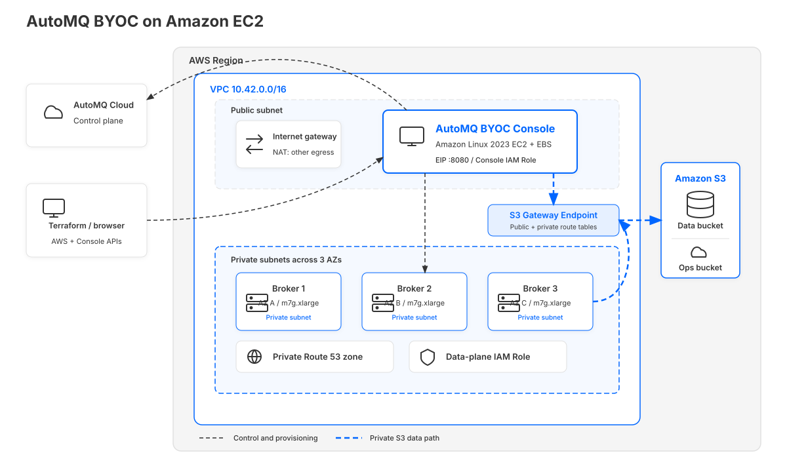
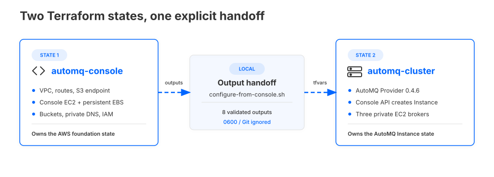

# AutoMQ on Amazon EC2

This Terraform quick-start provisions an AutoMQ BYOC Console and an optional
AutoMQ data plane in a new AWS VPC. It is designed for evaluation and rapid
validation. The default HTTP and Kafka security settings are not a production
architecture.

## Quick Start

Before starting, make sure you meet the [prerequisites](#prerequisites). This
path uses the evaluation defaults and creates billable AWS resources.
The default Cluster uses three Availability Zones and S3 WAL.

1. Follow [Register Your AutoMQ Environment](https://docs.automq.com/automq-cloud/getting-started/install-byoc-environment/aws/install-automq-on-aws#register-your-automq-environment)
   to create an AWS BYOC environment. Copy the complete Base64 value after
   `CONFIG=` from its EC2 installation command.
2. Configure and deploy the Console:

   ```bash
   cd automq-console
   cp terraform.tfvars.example terraform.tfvars
   # Set automq_config in terraform.tfvars to the complete CONFIG value.
   terraform init
   terraform plan
   terraform apply
   ```

3. Get the Console URL and initial login, then wait for the login page to
   respond:

   ```bash
   terraform output -raw console_endpoint
   terraform output -raw console_initial_username
   terraform output -raw console_initial_password
   ```

   Sign in, reset the initial password when prompted, and on **System
   Initialization** select **EC2 Mode Minimal Permissions** followed by
   **Authorization confirmed**.
4. Transfer the Console outputs and create the AutoMQ Cluster:

   ```bash
   cd ../automq-cluster
   ./configure-from-console.sh
   terraform init
   terraform plan
   terraform apply
   ```

5. Inspect the created Instance:

   ```bash
   terraform output -raw instance_id
   terraform output -raw instance_status
   terraform output -json instance_endpoints
   ```

Continue with the [detailed walkthrough](#detailed-walkthrough) for credential
handling, version selection, validation, and operational guidance.

## Architecture



The Console is the control plane inside the customer VPC. It provisions and
manages the three AutoMQ brokers in private subnets. Both route tables are
associated with the S3 Gateway VPC Endpoint, so Console and broker access to
the data and ops buckets uses the regional AWS private route. The NAT Gateway
remains available for container registries, package repositories, AutoMQ
Cloud, and other external APIs.

## What This Creates

The example has two Terraform root modules with independent state files:

| Stage | Terraform root | Resources |
| --- | --- | --- |
| Console and AWS foundation | `automq-console` | A VPC, one public and three private subnets across three Availability Zones, an internet gateway, a NAT Gateway, an S3 Gateway VPC Endpoint, S3 buckets, a private Route 53 zone, separate Console and data-plane IAM roles, and an Amazon Linux 2023 EC2 instance running the AutoMQ BYOC Console container |
| AutoMQ data plane | `automq-cluster` | A three-node IAAS AutoMQ Instance created through the local Console API |

`modules/automq-role` is called by `automq-console`; do not deploy it as a
third Terraform state.

The Console stage can be deployed by itself. Running `terraform apply` in the
Cluster root is the step that creates the AutoMQ data-plane nodes.



The two roots deliberately keep separate state. The handoff script copies only
the required Console outputs into a local, Git-ignored auto tfvars file; it
does not merge the state files or create the Cluster itself.

This layout intentionally uses one NAT Gateway and one public Console. It is a
compact evaluation topology, not a highly available network design.

## Prerequisites

- Terraform 1.5.7 or later.
- `jq` for transferring the Console outputs to the Cluster root.
- AWS credentials with permission to create the resources listed above.
- An AutoMQ Cloud account and a new AWS BYOC environment.
- A valid AutoMQ Cloud Usage Based subscription: either an unexpired Free
  Trial with remaining credit or an active AWS Marketplace payment method.
- An AWS Region with at least three available Availability Zones.
- Network access from the machine running Terraform to the Console on TCP
  8080. The default allowlist works when both Terraform stages run from the
  same public IPv4 address.

The Terraform caller needs create, read, update, and delete permissions for
the VPC/EC2, VPC Endpoint, EIP/NAT, EBS, IAM Role/Policy/Instance Profile, S3
bucket, and Route 53 resources in this example, plus read access to the public
AL2023 SSM AMI parameter. These are deployment permissions; Terraform creates
a separate, more limited runtime role for the Console. The machine running
Terraform also needs outbound HTTPS access to the Terraform Registry and,
unless an explicit allowlist is configured, `checkip.amazonaws.com`.

No existing VPC, subnet, Console AMI, SSH key, Environment ID input, or
separate AutoMQ Cloud client ID and secret inputs are required.

## Detailed Walkthrough

### 1. Get the Environment Metadata

Follow the official
[Register Your AutoMQ Environment](https://docs.automq.com/automq-cloud/getting-started/install-byoc-environment/aws/install-automq-on-aws#register-your-automq-environment)
instructions:

1. Sign in to [AutoMQ Cloud](https://account.automq.cloud), select
   **Create Environment**, choose **AWS**, and select the Region where this
   Terraform configuration will run.
2. After the environment is created, open its installation wizard and select
   the EC2 installation instructions. Keep the complete installation command.
3. Copy the entire value immediately after `CONFIG=` into the
   `automq_config` Terraform input. Do not decode it, edit it, or copy only the
   JSON inside it.
4. Find the Console container image reference in the same installation
   command. This revision defaults to
   `automq.azurecr.io/automq/automq-byoc-console:8.3.16-aws`. If the wizard
   shows a different image, set `console_image` to the exact value it shows.

Use metadata from one environment throughout both Terraform stages. Do not
combine a `CONFIG`, Environment ID, or Console image copied from different
environment records.

The Environment ID is displayed on the AutoMQ Cloud environment page and is
also the `environmentId` field inside `CONFIG`. The Console root decodes it and
exports `environment_id`; it is not a separate input.

`CONFIG` is complete Base64-encoded JSON, not an MD5 value. It includes the
Environment ID, Region, AutoMQ Cloud `clientId` and `clientSecret`, and the ops
bucket metadata needed by the Console. Base64 is not encryption, so treat the
entire value as a secret and never commit it.

These credentials have separate purposes:

| Credential | Created by | Used for |
| --- | --- | --- |
| AWS credentials in your shell or CI | Your AWS account | The AWS Terraform Provider creates VPC, IAM, EC2, S3, DNS, and related resources |
| `clientId` and `clientSecret` inside `CONFIG` | AutoMQ Cloud installation wizard | The BYOC Console registers and communicates with the AutoMQ Cloud control plane |
| `console_initial_access_key` and `console_initial_secret_key` | This Terraform example | The AutoMQ Terraform Provider authenticates to the local BYOC Console API to create the AutoMQ Instance |
| `console_initial_password` | This Terraform example | The initial `admin` user signs in to the Console UI once |

The Console API access and secret keys are not AWS access keys and are not the
AutoMQ Cloud `clientId` and `clientSecret` embedded in `CONFIG`.

### 2. Deploy and Initialize the Console

From this directory:

```bash
cd automq-console
cp terraform.tfvars.example terraform.tfvars
```

Set `automq_config` in `terraform.tfvars`. Set `console_image` as well when the
installation wizard shows an image different from the default. All other
inputs have working evaluation defaults. Changing the image also requires a
review of the version-specific IAM contract described below.

```bash
terraform init
terraform plan
terraform apply
```

Get the endpoint and initial login credentials:

```bash
terraform output -raw console_endpoint
terraform output -raw console_initial_username
terraform output -raw console_initial_password
```

An EC2 `running` state does not mean that the application is ready. Wait until
the Console login page responds before signing in. On the first successful
login, Console `8.3.16-aws` redirects the initial `admin` user to
**Reset Password**. Set a new password of 8-16 characters containing a letter,
a number, and a special character. The Terraform-generated initial password is
a one-time bootstrap credential and stops working after the reset.

The Console security group allows the public IPv4 detected during the latest
Terraform plan. If the browser or the later Cluster Terraform stage runs from
a different VPN, proxy, CI runner, or office network, set
`console_allowed_cidr_blocks` explicitly and apply the Console root again.

On **System Initialization**, select **EC2 Mode Minimal Permissions**, then
select **Authorization confirmed**. The IAM actions in `automq-console/iam.tf`
are taken from and contract-tested against the EC2 minimal permission checks
shown by System Initialization in Console `8.3.16-aws`. They are not a generic
administrator policy. Because that contract belongs to a specific Console
release, review and retest the IAM policies whenever `console_image` changes.

The reviewed contract includes FSx and EFS actions because the Console's EC2
permission check covers both NFS WAL implementations. This quick-start exposes
only the validated EFS configuration and does not support FSx WAL. It does not
grant EKS access or IAM role and policy lifecycle permissions. The Console and
data-plane nodes use separate IAM roles; the data-plane role is scoped to this
environment's S3 buckets and private hosted zone.

The AutoMQ Provider allows `data_buckets`, `dns_zone`, and `instance_role` to
be omitted when the Console manages those resources. This quick-start does not
use that mode. Terraform creates all three resources and passes their IDs to
the Cluster because the Console-managed path requires broader IAM, DNS, and
data-bucket lifecycle permissions than the selected EC2 minimal policy.

SSH ingress is not opened. For host diagnostics, get the instance ID and use
AWS Systems Manager Session Manager:

```bash
terraform output -raw console_instance_id
```

The bootstrap log is `/var/log/cloud-init-output.log`, and the container name
is `automq-console`.

### 3. Transfer the Console Configuration

After the Console is usable and System Initialization succeeds, generate the
Cluster inputs from the Console Terraform state:

```bash
cd ../automq-cluster
./configure-from-console.sh
```

The script reads the local `automq-console` outputs and writes
`console.auto.tfvars.json` with file mode `0600`. The file is ignored by Git
and contains the Console API credentials, Environment ID, broker networks,
data bucket, private DNS zone, and data-plane IAM role. Re-run the script after
replacing the Console or changing its foundation resources.

To read a Console state in another location, pass its directory explicitly:

```bash
./configure-from-console.sh /path/to/automq-console
```

For reference, the script applies this mapping:

| `automq-cluster` input | `automq-console` output |
| --- | --- |
| `console_endpoint` | `console_endpoint` |
| `console_access_key` | `console_initial_access_key` |
| `console_secret_key` | `console_initial_secret_key` |
| `environment_id` | `environment_id` |
| `broker_networks` | `broker_networks` |
| `data_bucket_name` | `data_bucket_name` |
| `dns_zone_id` | `dns_zone_id` |
| `instance_role_name` | `cluster_role_name` |

Optional Cluster overrides can be placed in `terraform.tfvars`:

```bash
cp terraform.tfvars.example terraform.tfvars
```

### 4. Create and Verify the AutoMQ Instance

The defaults create a three-node, `m7g.xlarge`, three-AZ, usage-based IAAS
Instance with AutoMQ data-plane version `5.5.3` and S3 WAL. Console image
versions and AutoMQ data-plane versions are separate release contracts. The
default data-plane version was live-validated with Console `8.3.16-aws`; select
an exact version available in your Console when using another image.
The default three-AZ S3 WAL path and the three-AZ EFS WAL path were both
live-created to `Running` and destroyed with this Console version.

The WAL mode must match the selected topology:

- The default `availability_zone_count = 3` supports `S3WAL` and EFS-backed
  `FSWAL`.
- `EBSWAL` requires `availability_zone_count = 1` in this quick-start.
- EFS WAL uses one `EFS_PROVISIONED` file system. FSx for NetApp ONTAP WAL is
  not supported or validated by this example.

To create a three-AZ EFS WAL Instance, add the following to
`automq-cluster/terraform.tfvars`:

```hcl
wal_mode                                  = "FSWAL"
efs_wal_throughput_mibps_per_file_system = 10
```

To create a single-AZ EBS WAL Instance instead:

```hcl
availability_zone_count = 1
wal_mode                = "EBSWAL"
```

Changing the WAL mode or selected Availability Zone count replaces the AutoMQ
Instance. Review the plan before applying either change.

To confirm the available data-plane version, open **Create Instance** in the
running Console and use an AWS version shown there. Do not infer
`automq_version` from the Console container tag; the two products use separate
version lines.

Review the plan carefully. The following apply creates billable data-plane
resources:

```bash
terraform init
terraform plan
terraform apply
```

The Cluster plan checks that the running Console returns HTTP 200 from its
login endpoint. This verifies reachability only; subscription eligibility is
evaluated by the Console when the Provider submits the Instance request. If the
Provider reports that no Usage Based subscription is available, open **AutoMQ
Cloud > Billing > Overview** and activate a valid Free Trial or link an AWS
Marketplace payment method by following the official
[BYOC Billing Instructions](https://docs.automq.com/automq-cloud/subscriptions-and-billings/byoc-env-billings/billing-instructions-for-byoc).

Inspect the Instance state and endpoints:

```bash
terraform output -raw instance_id
terraform output -raw instance_status
terraform output -json instance_endpoints
```

Terraform completion proves that the control plane accepted the Instance; it
does not prove Kafka client traffic. The default Kafka endpoints are private.
From a client with network access to the VPC, run a produce and consume smoke
test against a temporary topic:

```bash
kafka-topics.sh --bootstrap-server <bootstrap-servers> --create \
  --topic automq-ec2-smoke --partitions 3 --replication-factor 3
printf 'automq-ec2-smoke\n' | kafka-console-producer.sh \
  --bootstrap-server <bootstrap-servers> --topic automq-ec2-smoke
kafka-console-consumer.sh --bootstrap-server <bootstrap-servers> \
  --topic automq-ec2-smoke --from-beginning --max-messages 1
```

## Common Customizations

The quick-start fixes `pricing_mode` to `UsageBased` and
`reserved_node_count` to `3`. They are not Terraform inputs in this example;
use a separate deployment configuration when a different pricing mode or node
count is required.

| Input | Default | Notes |
| --- | --- | --- |
| `console_image` | `automq.azurecr.io/automq/automq-byoc-console:8.3.16-aws` | Prefer the exact image shown by the environment installation wizard |
| `console_allowed_cidr_blocks` | Terraform caller's public IPv4 `/32` | Set an explicit allowlist when the browser exits through another IP; avoid `0.0.0.0/0` |
| `console_instance_type` | `t3.large` | Meets the documented minimum of 2 vCPU and 8 GiB memory |
| `vpc_cidr` | `10.42.0.0/16` | A new VPC is created; accepted sizes are `/16` through `/20` |
| `data_bucket_name` | Generated bucket | An override must name a bucket that already exists in the same AWS account and Region; Terraform will not manage that bucket |
| `automq_version` | `5.5.3` | Must be an exact data-plane version available in the Console |
| `broker_instance_type` | `m7g.xlarge` | Used by every broker node |
| `availability_zone_count` | `3` | Select `1` for single AZ or `3` for three AZs |
| `wal_mode` | `S3WAL` | `EBSWAL` requires one AZ; `FSWAL` uses EFS and requires three AZs |
| `efs_wal_throughput_mibps_per_file_system` | `10` | Used only by EFS-backed `FSWAL`; accepted range is 10-1024 MiB/s |

## Security and Cost Boundaries

- The Console endpoint is plain HTTP on port 8080. Its security group defaults
  to the Terraform caller's public IPv4 `/32`. For a durable deployment, put
  the Console behind an HTTPS-capable load balancer or reverse proxy and
  restrict origin access.
- The Console instance explicitly receives a public address and an EIP. The
  public subnet itself does not automatically assign public IPs to other
  instances.
- Kafka defaults to anonymous plaintext access, but only on the private VPC
  networks. Do not expose these endpoints publicly. Configure authentication
  and encryption appropriate for production outside this quick-start.
- The Console EC2 instance requires IMDSv2 and has no SSH ingress.
- The Console security group permits unrestricted outbound traffic because the
  installation needs dynamic AWS API, AL2023 package repository, AutoMQ Cloud,
  and container registry endpoints. Replace this with approved egress paths or
  private endpoints for a controlled production network. S3 is the exception:
  the public and private route tables use the S3 Gateway VPC Endpoint, so S3
  traffic does not traverse the IGW or NAT Gateway. The endpoint uses its
  default policy; the Console and data-plane IAM roles continue to enforce the
  bucket access boundaries.
- Module-created S3 buckets use SSE-S3, and EBS volumes use AWS-managed
  encryption keys. This quick-start does not create customer-managed KMS keys,
  VPC Flow Logs, S3 access-log buckets, or S3 versioning. Add controls required
  by your organization's production baseline separately.
- Terraform state contains `CONFIG`, the initial admin password, and the
  Console API keys. Use encrypted remote state with tightly restricted access.
  Do not commit state, plans, `terraform.tfvars`, or generated auto tfvars.
- Applying the Console stage incurs charges for a NAT Gateway, public IPv4
  addresses, a `t3.large` instance, EBS volumes, Route 53, S3, and data
  transfer. Applying the Cluster stage adds at least three broker instances and
  their storage. EFS WAL also creates a provisioned-throughput EFS file system.
  S3 Gateway VPC Endpoints have no hourly or data-processing charge. Consult
  the AWS Pricing Calculator for the selected Region.
- Module-created data and ops buckets default to `force_destroy = true` so
  evaluation cleanup succeeds. Set the corresponding variables to `false` when
  object retention is more important than one-command teardown.

## Troubleshooting

**The Console URL does not respond.** Wait for cloud-init and the container to
finish starting. Use Session Manager to inspect
`/var/log/cloud-init-output.log` and `docker logs automq-console`. If your
public IP changed or your browser uses a different VPN or proxy exit, set
`console_allowed_cidr_blocks` explicitly and apply the Console root again.

**System Initialization reports missing permissions.** Confirm that
**EC2 Mode Minimal Permissions** is selected and that the running image matches
`console_image`. The included IAM contract is pinned to Console `8.3.16-aws`;
review it before using another Console release.

**The Cluster provider returns an authentication error.** Confirm that the
Console is ready, then re-run `./configure-from-console.sh`. Do not substitute
AWS keys or the `clientId` and `clientSecret` from `CONFIG` for the generated
Console API keys. Also confirm that the machine running Cluster Terraform is in
`console_allowed_cidr_blocks`.

**Instance creation returns `Instance.NoAvailableSubscription`.** Open **AutoMQ
Cloud > Billing > Overview**. The Organization needs either an unexpired Free
Trial with remaining credit or an active AWS Marketplace payment method. After
activation, allow up to one minute for the Console to refresh its subscription
status, then run `terraform apply` again.

**The requested AutoMQ version is unavailable.** Choose an exact data-plane
version exposed by the running Console. Do not derive `automq_version` from the
Console container tag; they use independent version numbers.

**The plan rejects the WAL and Availability Zone combination.** Use single-AZ
`EBSWAL`, or use `S3WAL` or EFS-backed `FSWAL` for a three-AZ Instance. This
example does not support FSx WAL.

**The ops bucket already exists or is owned by another account.** Each new
AutoMQ Cloud environment supplies an ops bucket name in `CONFIG`. Use a newly
registered environment whose generated bucket is available in the target AWS
account and Region.

## State Migration and Cleanup

The previous flat configuration at the legacy `ec2-custom` path is not
state-compatible with this two-root layout. Destroy it with the old revision
before switching, or use new backend keys or workspaces. Do not point an
existing flat state at these directories and apply it in place.

Use a separate state for each AutoMQ Environment ID. Replacing `automq_config`
with metadata from another environment while retaining the Console data volume
can mix persistent Console metadata with the wrong control-plane identity.

Destroy the Cluster state first so no data-plane nodes depend on IAM, DNS,
subnets, or buckets owned by the Console state:

```bash
cd automq-cluster
terraform destroy

cd ../automq-console
terraform destroy
```

A data bucket supplied through `data_bucket_name` is not created or deleted by
this example. Destroying the Console root deletes its persistent Console EBS
volume. Module-created buckets can also lose all stored objects during destroy
when their `force_destroy` setting is `true`.
