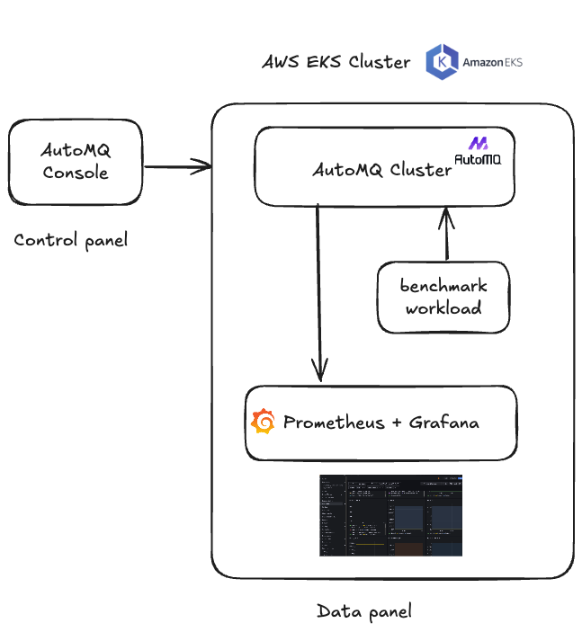

# AutoMQ Quick Setup & Benchmark

Deploying a complete AutoMQ cluster on AWS traditionally involves multiple, complex steps, from setting up the control
and data planes to manually configuring a separate observability environment and benchmarking tools.

This project eliminates that complexity. It is designed to provide a seamless, one-click solution using Terraform to
automatically provision an entire AutoMQ ecosystem on AWS.

The primary goal is to empower users to effortlessly spin up a fully operational, observable, and testable AutoMQ
cluster, drastically reducing setup time and manual configuration.

## Overview

This project follows a simple, three-step end-to-end flow to go from infrastructure to benchmarking with minimal manual
work:

The resources that need to be installed this time include EKS, along with three corresponding node groups, about 10 EC2
instance, and their AutoMQ Console nodes.

1) Provision with Terraform: bring up the required components — `EKS`, `AutoMQ Console` (BYOC control plane), and the
   observability stack (Prometheus/Grafana). After this step, the Kubernetes cluster and monitoring environment are
   ready.

2) Configure in AutoMQ Console and create the cluster: create the required `Profile` and credentials in the Console,
   then create or connect your `AutoMQ Cluster` (BYOC). Use these values in the subsequent Terraform/Helm configuration
   to enable connectivity.

3) Run benchmarks via the provided Helm chart: go to `automq-benchmark-chart`, set connection details and workload
   parameters (topics, partitions, message size, concurrency, etc.), deploy the benchmark Job, and observe throughput
   and latency in Grafana.

## Architecture



## Prerequisites

Before using this project, ensure you have:

### Required Tools

- **Terraform** (>= 1.0)
- **kubectl** configured for your EKS cluster
- **Helm** (>= 3.0)
- **AWS CLI** configured with appropriate permissions

### Required Permissions

- EKS cluster management permissions
- EC2 instance and networking permissions
- IAM role management permissions
- S3 bucket access (for AutoMQ data storage)

## Quick Start

### Step 1: Deploy Benchmark Infrastructure

This step provisions and integrates everything via Terraform in `./terraform`:

- EKS cluster (creating and configuring required `VPC`, subnets, `Security Group`, `IAM`, and related
  networking/permission resources)
- AutoMQ BYOC Console (deployed in the same VPC public subnet, with access and security integrated to the EKS cluster)
- Observability stack (Prometheus/Grafana) installed via Helm `kube-prometheus-stack` for collecting and visualizing
  benchmark metrics

All necessary cloud resources (including networking and object storage such as `S3`) will be newly created and wired up
in this step.

1. Plan the Deployment Run terraform plan to preview the resources that will be created.

Tip: To control resource naming and avoid conflicts, set `resource_suffix` in `./terraform/variables.tf`.

```bash
cd ./terraform
terraform init
terraform plan
```

2. Apply the Deployment After reviewing the plan, execute terraform apply to begin the deployment. This process may take
   25-30 minutes.

```bash
terraform apply
```

Enter yes at the prompt to confirm.

Upon successful deployment, Terraform will display the following outputs. You can also retrieve them at any time using
the `terraform output` command:

| Name                              | Description                                                |
|-----------------------------------|------------------------------------------------------------|
| `console_endpoint`                | The endpoint URL for the AutoMQ BYOC Console.              |
| `initial_username`                | The initial username for logging into the Console.         |
| `initial_password`                | The initial password for logging into the Console.         |
| `cluster_name`                    | The name of the created EKS cluster.                       |
| `node_group_instance_profile_arn` | The IAM Instance Profile ARN used by the EKS node group.   |
| `dns_zone_id`                     | The Route 53 DNS Zone ID created for the BYOC environment. |
| `vpc_id`                          | The ID of the VPC created for the environment.             |
| `env_id`                          | The ID of the AutoMQ environment.                          |

Terraform will initiate the corresponding EKS-related nodes and the AutoMQ control plane, and create an AutoMQ cluster
within EKS. You can use console_endpoint and initial_username/initial_password to log in to the AutoMQ Console.

To access the EKS cluster using this command, and the placeholders in the command can be replaced with the actual values
obtained from the output above.

```bash
aws eks update-kubeconfig --region [your-region] --name [your-cluster-name]
```

To visit the observability stack, use the following command to obtain the public endpoint of Grafana.
The username is admin, and the password can be obtained through the command below. If you wish to change it, you can
configure it in the `./terraform/monitoring/prometheus.yaml` file.

AutoMQ provides [grafana official dashboards](https://www.automq.com/docs/automq/observability/dashboard-configuration),
and you can contact the AutoMQ team to obtain the dashboard JSON. Once users export metrics to Prometheus, they can
import these Grafana dashboard templates, configure the Grafana data source to link to the respective Prometheus, and
begin monitoring AutoMQ.

```bash
# Get the public endpoint of Grafana. Please make sure to use the HTTP protocol for access.
kubectl get service prometheus-grafana -n monitoring

# Get the Grafana password
kubectl get secret prometheus-grafana -n monitoring -o jsonpath="{.data.admin-password}" | base64 --decode
```

### Step 2: Deploy AutoMQ Instance

1.Follow [Create a Service Account](https://www.automq.com/docs/automq-cloud/manage-identities-and-access/service-accounts#create-a-service-account)
to create a Service Account and obtain the `Client ID` and `Client Secret` (used as `automq_byoc_access_key_id` and`automq_byoc_secret_key`). It is recommended to use EnvironmentAdmin for convenient management of all resources.

2. In the AutoMQ Console, create a Deploy Profile for the EKS environment (e.g., named `eks`). Kubernetes Cluster, DNS ZoneId, Bucket Name, and IAM Role ARN are all obtained from the output of the previous step.
   Reference: [Create a Deploy Profile](https://www.automq.com/docs/automq-cloud/deploy-automq-on-kubernetes/deploy-to-aws-eks#step-12%3A-access-the-environment-console-and-create-deployment-configuration).

3. Fill variables `automq/terraform.tfvars` and apply Terraform to create the AutoMQ cluster with observability
   integration. You may need to wait approximately 5 to 10 minutes for the cluster to be fully created.

The following are the parameters you must fill in within the `terraform.tfvars` file, and the Notes document provides information on how to obtain them along with their explanations. The remaining parameters can be further configured according to the needs of the cluster.

| Parameter                          | Description                            | Notes                                                                                                                                                   |
|------------------------------------|----------------------------------------|---------------------------------------------------------------------------------------------------------------------------------------------------------|
| `automq_byoc_endpoint`             | AutoMQ BYOC Console API endpoint       | Get from output of step1                                                                                                                                |
| `automq_byoc_access_key_id`        | BYOC API Access Key (Client ID)        | Obtained when creating the Service Account in the previous step.                                                                                        |
| `automq_byoc_secret_key`           | BYOC API Secret Key (Client Secret)    |                                                                                                                                                         |
| `automq_deploy_profile_name`       | Deploy Profile name created in Console | Obtained when creating the Deploy Profile in the previous step.                                                                                         |
| `automq_environment_id`            | AutoMQ Environment ID                  | Get from output of step1                                                                                                                                |
| `vpc_id`                           | VPC ID                                 | Get from output of step1                                                                                                                                |
| `automq_environment_id`            | ENV ID                                 | Get from output of step1                                                                                                                                |
| `prometheus_remote_write_endpoint` | prometheus inner endpoint              | Allow the AutoMQ control plane to access Prometheus using the Prometheus service name and namespace.<br/> Use `kubectl get svc -n monitoring` to check. |


```bash
cd ./automq
terraform init
terraform plan
terraform apply
```

#### AutoMQ tfvars Parameters

Use the following variables in `cloudservice-setup/aws/eks-benchmark/automq/terraform.tfvars` to connect Terraform to
your AutoMQ Console and environment:

### Step 3: Run Benchmark Tests

This step executes performance tests against your AutoMQ cluster using configurable workloads. The benchmark simulates
Kafka usage patterns with customizable parameters for throughput, message size, topic configuration, and test duration.
The tests generate comprehensive metrics that are automatically collected by your monitoring stack.

For specific configurations of helm values, you can refer to the [README](./automq-benchmark-chart/README.md) in the
automq-benchmark folder for further details.

The current stress testing machine is a single node with a maximum network bandwidth of 10Gbps considering the node instance type. In the `values.yaml` file, the default rate is to write 160 messages per second, each 51 KiB in size (without any batching), with a write speed of 8 MiB/s. 
If you need to conduct a larger scale test, you can adjust the parameters or contact the AutoMQ team for further assistance. 
More details about stress testing tools can be found in this [blog](https://www.automq.com/blog/how-to-perform-a-performance-test-on-automq).

**Expected Result**: Benchmark jobs will run and generate load against the AutoMQ cluster. Performance metrics including
throughput, latency, and resource utilization will be collected and visible in Grafana dashboards. You should see data
flowing through the system and performance characteristics of your AutoMQ deployment.

1. **Configure benchmark parameters**:

```bash
cd helm-chart/automq-benchmark
```

2. **Deploy benchmark workload**:

```bash
helm install automq-benchmark . \
  --namespace default \
  --values values.yaml
```

3. **View results in Grafana**:
    - Access your Grafana dashboard
    - Navigate to AutoMQ performance dashboards
    - Observe real-time metrics during the test execution

After completing the above steps, you can see the corresponding metrics on the Grafana dashboard. Adjust the stress test parameters according to the corresponding specifications to further understand the specifications and performance related to AutoMQ.

## Cleanup

To remove all deployed resources:

```bash
# Remove benchmark workload
helm uninstall automq-benchmark

# Remove AutoMQ instance
cd automq
terraform destroy

# Remove EKS and AutoMQ Console
cd terraform
terraform destroy
```